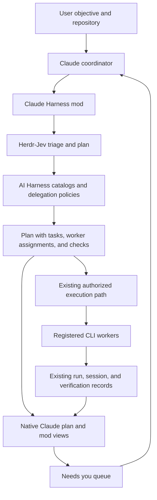

# Claude Harness mod: product and integration plan

Status: planning only. No mod implementation, plugin installation, worker launch, or Harness configuration change is part of this delivery.

Build a Claude Code interface for the existing AI Harness and Herdr-Jev. Claude remains the coordinator; each task shows its proposed CLI, exact model, reasoning effort, selection reason, dependencies, and evidence of completion. The eventual product chooses and runs workers through existing Harness policies, as requested. This document defines that product before implementation.

## What to take from each reference

| Reference | Best idea to reuse | How it fits our mod |
| --- | --- | --- |
| [task-line](https://github.com/muellerei/task-line) | Compact progress above the prompt, based on real task updates; clear waiting, failure, and completion states. | Show the current task, assigned worker, completed count, and pending human decisions. Progress is completed tasks divided by total tasks, not an estimate of time. |
| [claude-work-visualized](https://github.com/GrzeskoByte/claude-work-visualized) | A live project map driven by observed reads, edits, creations, and deletions. | Add an optional activity pane grouped by task and worker. Show which files each worker actually touches, including external CLI workers when their existing adapter exposes activity. |
| [harness-scope](https://github.com/shimo4228/harness-scope) | One global setup with repository-specific relevance and visible profile provenance. | Show the repository's resolved agent, runbook, skills, tools, and permitted workers from our canonical Harness catalogs. Reuse existing scope selection rather than introduce another profile configuration system. |
| [human-in-the-loop](https://github.com/tzafrir/human-in-the-loop) | Persistent, actionable human tasks with a reason, completion criterion, and answer channel. | Keep decisions, access requests, and manual checks in a “Needs you” queue attached to the requesting task. Unrelated work continues; dependent work waits. |
| Existing Herdr-Jev | Task triage, execution plans, native peer conversations, quota handling, and run reconciliation. | Supply worker recommendations and manage the worker lifecycle. |
| Existing AI Harness | Canonical routes, model catalogs, delegation profiles, tasks, verification, session continuity, and provenance. | Remain the authority for execution and durable state. |

These are design references. Do not install all four mods or copy their storage and orchestration systems. If implementation reuses upstream code, retain its license and attribution.

## User experience

The normal view stays small. A proposed layout, with illustrative assignments:

```text
recast · develop-typescript-javascript
● Implement change · Codex/<resolved model>  ━━━━──────  2/5  40%
? 1 decision needs you · Open plan · Workers · Activity
```

The expanded plan contains:

| Task | Worker | Why selected | Depends on | State |
| --- | --- | --- | --- | --- |
| Investigate the issue | Kimi/<resolved model> | Best eligible match from current routing evidence | — | Proposed |
| Implement the change | Codex/<resolved model> | Matches the authorized implementation route | Investigation | Proposed |
| Inspect the interface | Antigravity/<resolved model> | Matches the available visual workflow | Implementation | Proposed |
| Verify and review | Worker required by the exact review profile | Preserves independent review | Implementation | Proposed |

These assignments demonstrate the interface, not a fixed routing matrix or a claim that those models are currently available. Any registered CLI can appear when its existing adapter and policies support the task.

For every task, show the objective, repository, owned paths, acceptance checks, selected route, alternatives considered, and a short selection reason. Show “proposed,” “assigned,” “running,” “waiting,” “failed,” “unknown,” and “verified” separately. Terminal idleness and a successful process exit alone do not prove the objective was achieved.

Claude's native plan should include the same worker assignments and checks. Return a compact Markdown plan through the planning tool and let Claude write its normal plan artifact. The pane displays that plan's task identities; it does not maintain a competing plan. Native plan approval remains native.

## Architecture: adapter over the existing system



Start the Claude-specific adapter alongside Herdr-Jev, provisionally at `herdr-jev/claude-plugin/`. Shared routing improvements, if needed, belong in the existing Herdr-Jev or AI Harness modules. The mod owns presentation and user interactions; it does not own another scheduler, model registry, quota service, memory provider, or daemon.

Use [Claude Code's supported mods API](https://code.claude.com/docs/en/plugins/mods/api): register tools and commands at session start, invoke existing CLIs with argument vectors through `$.process.run`, and draw the band and optional pane with `ui.render`. Chain rendering with `next(e)` so other mods remain visible. Read the actual session model through `$.session.model()`; do not infer it from a client default.

A small initial interface is enough: `/harness` opens the plan and workers, a planning tool returns the resolved plan, and an execution tool invokes the existing authorized run path. Names are provisional. Observational hooks update the display; they do not silently dispatch workers, approve tools, or change permissions.

## How worker selection should work

1. Resolve repository instructions and the matching agent → runbook → skills/CLIs from the existing Harness catalogs.
2. Classify each bounded task through Herdr-Jev, retaining any distinction between model inference and heuristic fallback.
3. Resolve the real coordinator client/model and exact delegation profile. Treat Jev's advisory stages and authorized execution stages as different records.
4. Consider only permitted clients and verified model IDs. Respect user overrides, independent review profiles, supported effort settings, and repository ownership.
5. Check current authentication, applicable quota, installed adapters, and available capabilities. An installed binary or detector “healthy” label does not establish usable provider quota.
6. Choose the best eligible match using the existing routing evidence: task fit, capability, quota, and measured cost/latency where available. Display the reason and missing evidence. Never claim an objectively best model without comparative evidence.
7. Revalidate before dispatch. If the recommendation is no longer eligible, show the changed reason and follow existing fallback policy; do not silently substitute an exact required reviewer or executor.

Antigravity, Codex, Kimi, Claude, and other registered harnesses use their canonical aliases and native model discovery. Unknown models, stale quota, or absent exact profiles remain explicit limitations. Work can stay in the coordinator when existing policy permits direct execution.

## Reuse these interfaces

| Existing interface | Intended use |
| --- | --- |
| `herdr-jev plan <task> --json` | Triage and proposed stages, including the distinction between advisory and authorized stages. Supply actual caller context. |
| `ai-harness delegation-plan`, `model-resolve`, `model-catalog`, `skill-select` | Resolve canonical policy, model IDs, and relevant skills/CLIs. |
| `herdr-jev detect --json` and `quota status` | Preflight inputs; reconcile them with fresh native observations. |
| `herdr-jev route`, `run-status`, `run-resume` | Existing supervised execution and reconciliation for applicable canonical pipelines. |
| `herdr-jev subagent`, `peer-message`, `peer-read` | Persistent cross-CLI collaboration when permitted, with the same stable handle for follow-ups. |
| `ai-harness task-submit`, `task-run --once`, `task-inspect` | Existing durable task execution when that route fits the task contract. |
| Existing session continuity and review interfaces | Restore task ownership, inspect worker state, and display verification evidence. |

Pick one execution owner per task. A task must not be independently launched by both the Harness task runner and a Herdr-Jev peer path. The adapter links the native task/run/session IDs; it does not invent a second execution ledger.

### Integration gaps to resolve during implementation

The current Jev planner already distinguishes `stages` from `executionStages`. Its canonical execution profile can prescribe workers from the coordinator's own client even when advisory stages suggest other CLIs. Therefore, a recommendation to use Kimi or Antigravity is not itself executable authorization. Extend the existing routing contract only where required; keep the distinction visible.

The existing task specification requires a repository, base commit, owned paths, execution route, and success checks. A todo title alone cannot be submitted as a runnable task. Claude must supply the bounded task contract before execution.

External CLI activity is not captured by Claude's own tool hooks. Use existing worker/session adapters and their events; when an adapter lacks file-level events, show its available run state and mark detailed activity unavailable. Do not fabricate activity or infer authorship from shared-directory file changes.

## Human tasks and repository scope

Human tasks need a requesting task/session, reason, completion criterion, optional choices, and status. Deduplicate repeated asks. Deliver answers to the requesting coordinator and unblock only the affected dependencies. Resume and compaction should restore outstanding asks from the existing continuity system; module state can cache display data, while durable memory remains in the Harness/Ruflo system.

“Done” on a human task is a response, not proof that verification passed. Rerun the relevant check. Ask users to put secrets in the existing vault or configuration location and confirm completion; never ask them to paste credentials into the pane.

Adapt harness-scope's relevance idea without importing its policy-disabling behavior: expose the selected repository context, keep mandatory rules effective, honor explicitly invoked skills, and retain registered CLIs. A repository-supplied setting cannot broaden its allowed workers or remove global requirements.

## Delivery sequence

1. **Plan and progress view.** Build the CLI adapter, resolved-plan tool, compact band, and task/worker pane. Validate real plan output and show unavailable routes honestly. No worker launch from rendering or passive hooks.
2. **Execution through existing owners.** Connect authorized run paths, stable handles, verification, independent review, and reconciliation. Validate Antigravity, Codex, and Kimi separately with their actual adapters before claiming support. Start dependent work only after its prerequisites are satisfied.
3. **Activity and human queue.** Add task-attributed activity, human responses, compaction/resume, and repository-context details using the same task identities and existing state owners.

Each phase is usable on its own. Start with the band and plan pane; add a file map once worker attribution is available. Keep graphical animation optional and avoid a new dependency solely for decoration.

## Acceptance criteria

- A task's pane and native Claude plan agree on worker, model, effort, repository, and checks.
- No proposed worker is displayed as running before an actual accepted launch.
- Canonical delegation restrictions, unknown quota, and unsupported effort are represented accurately.
- Repeated tool calls, reloads, resume, and uncertain timeouts do not duplicate worker launches; uncertain work is reconciled before another writer starts.
- Verification failure stays visible; independent review retains its prescribed identity and isolation.
- Human answers reach the right task/session; unrelated work continues and dependent work waits.
- Activity from external workers is attributed from evidence or labeled unavailable.
- The band coexists with other mods; terminal and desktop rendering are tested, and headless sessions return textual results.
- Commands receive argv arrays, task text is excluded from structural telemetry, and credentials never enter the displayed plan or human queue.
- Plugin validation and runnable integration checks cover selection, failed launches, denied calls, replays, concurrent sessions, and restoration. Existing repository checks run before delivery.

The immediate next artifact is an implementation specification for the adapter and the task/run linkage, based on this plan. This planning delivery adds only this document.
